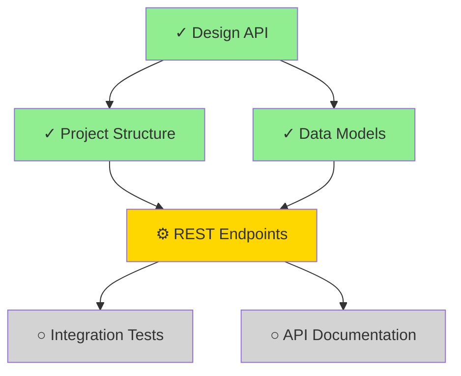

**ultrathink** - Take a deep breath. We're not here to write code. We're here to make a dent in the universe.

## The Vision
Task visualization should reveal the inevitable path to completion.

## Your Work, Step by Step
1. **Read tasks**: Load current state and dependencies.
2. **Map relationships**: Identify blockers and parallel paths.
3. **Render view**: ASCII or Mermaid, consistent and legible.
4. **Recommend**: Highlight next best actions.

## Ultrathink Principles in Practice
- **Think Different**: Look for hidden bottlenecks.
- **Obsess Over Details**: Keep statuses accurate.
- **Plan Like Da Vinci**: Choose the clearest representation.
- **Craft, Don't Code**: Make diagrams readable first.
- **Iterate Relentlessly**: Update as tasks change.
- **Simplify Ruthlessly**: Remove visual noise.

# Task Visualizer Skill (v2.26)

Provides ASCII and Mermaid visualization of task dependencies, following Gastown patterns for multi-agent orchestration.

## Features

- ASCII dependency graphs
- Status tracking with icons
- Blocked task detection
- Parallel execution hints
- Mermaid diagram generation

## ASCII Visualization Format

```
┌─────────────────────────────────────────────────────────────────┐
│                    TASK DEPENDENCY GRAPH                        │
├─────────────────────────────────────────────────────────────────┤
│                                                                 │
│  ✓ #1 Design API architecture ──────────────────► COMPLETED    │
│            │                                                    │
│  ┌─────────┴─────────┐                                         │
│  │                   │                                         │
│  ▼                   ▼                                         │
│  ✓ #2 Create        ✓ #3 Implement                             │
│    project            data models                              │
│    structure          COMPLETED                                │
│    COMPLETED             │                                     │
│        │                 │                                     │
│        └────────┬────────┘                                     │
│                 │                                              │
│                 ▼                                              │
│  ⚙ #4 Implement REST API endpoints ────────► IN_PROGRESS      │
│        ⚠ blocked by #2, #3 (now resolved)                     │
│                 │                                              │
│  ┌──────────────┴──────────────┐                               │
│  │                             │                               │
│  ▼                             ▼                               │
│  ○ #5 Write                   ○ #6 Create API                  │
│    integration                   documentation                 │
│    tests                         PENDING                       │
│    PENDING                       ⚠ blocked by #4               │
│    ⚠ blocked by #4                                             │
│                                                                 │
└─────────────────────────────────────────────────────────────────┘
```

## Status Icons

| Icon | Status | Description |
|------|--------|-------------|
| ✓ | completed | Task finished successfully |
| ⚙ | in_progress | Currently being worked on |
| ○ | pending | Waiting to start |
| ⚠ | blocked | Blocked by dependencies |
| ✗ | failed | Task failed |

## Usage

### Read Tasks

```bash
# Read current tasks from .ralph/tasks.json
cat .ralph/tasks.json | jq '.tasks'
```

### Visualize Dependencies

Generate ASCII visualization:

```
Task #1 Design    ─────────► RESOLVED
                      │
          ┌───────────┴───────────┐
          ▼                       ▼
Task #2 Structure          Task #3 Models
   RESOLVED                   RESOLVED
          │                       │
          └───────────┬───────────┘
                      ▼
            Task #4 Endpoints
              ⚠ blocked by #2, #3
```

### Mermaid Generation

Generate Mermaid diagram for documentation:



## Parallel Execution Detection

Tasks that share the same dependencies can run in parallel:

```
PARALLEL EXECUTION HINT:
Tasks #5 and #6 can run in parallel after #4 completes.
Suggested agent assignment:
  - #5 (tests): Codex (gpt-5.2-codex)
  - #6 (docs): Gemini (gemini-2.5-pro)
```

## Integration with Ralph

```bash
ralph tasks           # Show all tasks with visualization
ralph tasks --graph   # ASCII dependency graph
ralph tasks --mermaid # Mermaid diagram
ralph tasks --blocked # Show only blocked tasks
ralph tasks --parallel # Show parallelizable tasks
```

## Task Persistence

Tasks are stored in `.ralph/tasks.json` and survive:
- Session restarts
- Agent failures
- Claude Code restarts

Recovery pattern:
1. Read `.ralph/tasks.json`
2. Find tasks with status `in_progress` or `pending`
3. Resume execution from last checkpoint

## Security: Schema Validation (CWE-1286 Prevention)

**MANDATORY**: All task operations MUST validate against `.ralph/tasks-schema.json`:

### Before Reading Tasks

```bash
# Validate JSON structure before parsing
if ! jq empty .ralph/tasks.json 2>/dev/null; then
  ERROR: "Invalid JSON in tasks.json - file may be corrupted"
  RECOVERY: "Backup current file and reinitialize"
fi

# Validate against schema (if ajv installed)
if command -v ajv &>/dev/null; then
  ajv validate -s .ralph/tasks-schema.json -d .ralph/tasks.json
fi
```

### Before Writing Tasks

```bash
# Validate task content before writing
validate_task_content() {
  local content="$1"
  # Check maxLength (2000 chars)
  if [ ${#content} -gt 2000 ]; then
    ERROR: "Task content exceeds 2000 character limit"
  fi
  # Check for forbidden characters (injection prevention)
  if [[ "$content" =~ [\<\>\{\}\$\`] ]]; then
    ERROR: "Task content contains forbidden characters: < > { } $ \`"
  fi
}
```

### Input Sanitization Rules

| Field | Max Length | Allowed Pattern | Forbidden |
|-------|------------|-----------------|-----------|
| `content` | 2000 | `^[^<>{}$\`]*$` | `< > { } $ \`` |
| `message` | 5000 | `^[^<>{}$\`]*$` | `< > { } $ \`` |
| `project` | 500 | `^[a-zA-Z0-9._/-]+$` | Special chars |
| `session_id` | 100 | `^[a-zA-Z0-9._-]*$` | Special chars |

### Safe Task Creation Example

```yaml
# SAFE: Sanitized task creation
new_task:
  id: $(jq '.tasks | length + 1' .ralph/tasks.json)
  content: $(validate_task_content "$USER_INPUT")  # MUST validate
  status: "pending"  # MUST be enum value
  created_at: $(date -u +"%Y-%m-%dT%H:%M:%SZ")
```
